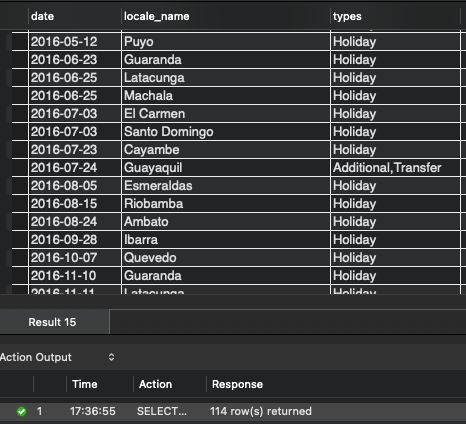

---
jupytext:
  formats: md:myst
  text_representation:
    extension: .md
    format_name: myst
    format_version: 0.13
    jupytext_version: 1.15.0
kernelspec:
  display_name: Python 3 (ipykernel)
  language: python
  name: python3
---

# Documentation and Reasoning for SQL Query

This page documents the thought and reasoning process of arriving at the final state of the query to be used in the dataset analysis for this project.

## Motivation of building this query
The final state of the query is built upon the consideration of joining all necessary tables together as a complete table. When queried into working notebook as pandas dataframe, EDA can begin without the need to perform pandas join afterwards. Having a complete or full dataframe to begin with also allows slicing and dicing much easier (i.e. EDA on a particular city or stores).

## The aim for the query final state
Merge as much columns as we can together in the early stage of the project. We will not be needing to jump between database and working space to dig for more data at later phase of analysis. 

## About the setup

Workstation: MacOS 13 (arm64)<br>
Software: MySQL Community Server - GPL (8.0.33)<br>
Environment: localhost

## About the database and dataset

The 5 main files used in our analysis are the following csv files which are locally uploaded using MySQL Workbench. Therein these csv files are located in `time_series` database. We also use the file names as name of individual tables and simple abbreviations in our query to be straightforward.

<div align="center">

| File name | Table name (In database) | Table name (In query) |
| :--- | :---: | :---: |
| holiday_events.csv | holiday_events | `hols` |
| oil.csv | oil | `o` |
| stores.csv | stores | `st` |
| train.csv | train | `tr` |
| transactions.csv | transactions | `txn` |
</div>

## More about the dataset

### Size of tables

Let's first take a quick look at the size of tables.

```sql
-- Replace table name to check size of each table
SELECT COUNT(*)
FROM holidays_events;

SELECT COUNT(*) 
FROM INFORMATION_SCHEMA.COLUMNS
WHERE TABLE_SCHEMA = 'time_series' AND table_name = 'holidays_events';
```

<div align="center">

| Table name (In database) | Rows x Columns
| :---: | :---
| holiday_events | 350 x 6
| oil | 1218 x 2
| stores | 54 x 5
| train | **3000887 x 6**
| transactions | 83488 x 3
</div>

As train table contains the most number of rows, consider it as the fact table and the other tables as dimensions tables.

### Timeline of cities
Analyzing the length of each cities' timeline can give us a rough idea of how distributed each city time series between each other.

Why prioritize analysis on cities? Because city is on a more granular level. By inspecting on city level, we ensure we do not miss out hidden patterns as compared to analysis done on state and national level.

```{admonition} Query Explanation

````

```sql
WITH CityStartEnd AS (
  SELECT
    MIN(tr.date) AS city_start_date,
    MAX(tr.date) AS city_end_date,
    st.city
  FROM train AS tr
  LEFT JOIN stores AS st
    ON tr.store_nbr = st.store_nbr
  GROUP BY st.city
)

SELECT
  ROW_NUMBER() OVER (ORDER BY city) AS row_num,
  city_start_date,
  city_end_date,
  city
FROM CityStartEnd;
```

Join `train` and `store` tables with `store_nbr` being the common column. We only join `city` instead of `state` as city is on a more granular level and one column is sufficient for now in this analysis.

<div align="center">


</div>

Results from this analysis: Each city has the same timeline range from 2013-01-01 to 2017-08-15. But this does not guarantee that all cities will have equal number of time points (observations) so let's also check that.

### Time points of cities

```{admonition} Query Explanation

````

```sql
WITH CityObCounts AS (
  SELECT
    COUNT(*) AS time_points,
    st.city,
    st.store_nbr
  FROM train AS tr
  LEFT JOIN stores AS st
    ON tr.store_nbr = st.store_nbr
  GROUP BY st.city, st.store_nbr
)

SELECT
  ROW_NUMBER() OVER (ORDER BY city, store_nbr) AS row_num,
  time_points,
  city,
  store_nbr
FROM CityObCounts;
```
<div align="center">

| Cities time points page 1 | Cities time points page 2
:-------------------------:|:-------------------------:
 | 
</div>

Looks like all cities are having the same number of time points. It is noted that Quito store number 1 has 1 less observation. During this high level analysis, it is not significant right now.

### City/State hierarchy in Ecuador
Considering Ecuador being the country as root node in the hierarchy. This sub-section explores a high level analysis on the dataset for the following hierarchy relationship. Ecuador is the country so it is the root of the hierarchy.

<div align="center">


</div>

```{admonition} Query Explanation

````

```sql
WITH CityStoreCount AS (
  SELECT
    state,
    COUNT(DISTINCT city) as city_count,
    COUNT(*) as store_count
  FROM stores
  GROUP BY state
)

SELECT
  ROW_NUMBER() OVER (ORDER by state) AS row_num,
  state,
  city_count,
  store_count
FROM CityStoreCount;
```

<div align="center">


</div>

Most cities have around 1 to 3 stores. Pichincha have the most store count due to Quito, Ecuador's capital, being one of it's city. If we also drill deeper into store count for individual cities, we see that Quito does has the most store count.

```{admonition} Query Explanation

````

<div align="center">


</div>

### Holidays
The Kaggle competition has provided [some noteworthy pointers about the holidays](https://www.kaggle.com/competitions/store-sales-time-series-forecasting/data). So it is better that we do some analysis on the holidays of each city, state and nation. 

Due to how the Ecuador government decides the celebrated dates of the holiday, it poses some challenge in building the query. We need to be careful when merging the columns. Many times during the merging, we realized duplicated dates in `holidays_events` caused the query result to explode with additional rows with null values. The duplicated dates (`date` column) from `holidays_events` as the right table (recall that `train` is the main table, hence `train` is the left table) have resulted in a many-to-one relationship with `date` column in `train`.

Also, we were given holidays for year 2012 when the `train` starts from 2013.

Let's first count the number of days from 2012 to 2017 for each city and state, and also the nation itself, with the exclusion of the following conditions (exclude those days from the query results):
1. Days where `transferred = True` does not count as an actual celebrated day.
2. Type of day where `type = Work Day` does not count as a celebration day.
3. Include `date` which are between `2013-01-01` - `2017-08-15`. This will align with the date range from `train`.

```{note}
Without knowing the number of days of holiday for each city first will not allow us to validate the next part of SQL join is done correctly. That is why in the earlier part, we analysis for each city the number of days of holiday.
```

```sql
WITH HolidayCount AS (
  SELECT
    COUNT(DISTINCT date) AS num_hols,
    locale_name,
    locale
  FROM holidays_events
  WHERE transferred = 'False' AND type != 'Work Day' AND date BETWEEN '2013-01-01' AND '2017-08-15'
  GROUP BY locale_name, locale
)

SELECT
  ROW_NUMBER() OVER (ORDER BY locale, locale_name) AS row_num,
  locale,
  locale_name,
  num_hols
FROM HolidayCount;
```

<div align="center">


</div>

Not all cities and states have holidays. As analyzed in the previous sub-section, there are 16 states and 22 cities. But now, we see that only 4 states and 19 cities have holidays.

# First merge for the final query

In this section, we explored the merging of columns between `train` and `holidays_events` tables. We want to have information of all holidays because these information may be related to the sales of products in `train`. Before we can do the first merge, we need a common identifying column because both `train` and `holidays_events` table do not have a common column.

- First, we can make use of `store_nbr` column from `stores` table.
- We do a LEFT JOIN on both `city` and `state` columns into `train`. Because in `holidays_events` table, there is `locale_name` column which contains name of cities and states. 

As of now, we are only interested in holidays for cities (states will come later). The query below returns 3,000,887 rows which is the same as the original rows for `train`.

```sql
SELECT
  tr.*,
  st.city
FROM time_series.train AS tr
LEFT JOIN time_series.stores AS st
  ON tr.store_nbr = st.store_nbr;
```

<div align="center">


</div>

- Now, we have `city` column in `train`. We are ready to join `date` column from `holidays_events` so that we know how daily sales of cities' store are affected by holidays.
- We start with a query which tells us all holiday dates for cities only. We take the same query from CTE `HolidayCount` and from `holidays_events` include a new condition to filter city rows.

```sql
SELECT
  date,
  locale_name,
  transferred
FROM holidays_events
WHERE type != 'Work Day' AND transferred = 'False' AND locale = 'Local' AND date BETWEEN '2013-01-01' AND '2017-08-15'
GROUP BY date, locale_name, transferred;
```

```{attention}
Notice now we have the unique, this makes a one-to-many relationship of `date` columns between `train` and the query below.

This was an important step for the next part of the SQL join because there were a lot of times we found ourselves with explosion of rows with NULL values.
```

<div align="center">


</div>

- For this second part of SQL LEFT join, we take the previous query and put it as a subquery, calling it `subquery_c`.
- We join on 2 sets of matching columns - date and city name columns from `train` and `subquery_c`.
- Where there is a match on the 2 sets of matching columns from both table, temporary return value from `transferred` column from `subquery_c`, and rename if as `Yes`. If there is no match, indicating there is no holiday on that day of the city, `NULL` will be returned, and rename it as `No`.

```sql
SELECT
  tr.*,
  st.city,
  st.state,
  IF(subquery_c.transferred IS NULL, 'No', 'Yes') as city_hols
  FROM train as tr
  LEFT JOIN stores as st
    ON tr.store_nbr = st.store_nbr
  LEFT JOIN (
      SELECT
        date,
        locale_name,
        transferred
      FROM holidays_events
      WHERE locale = 'Local' AND type != 'Work Day' AND transferred = 'False' AND date BETWEEN '2013-01-01' AND '2017-08-15'
      GROUP BY date, locale_name, transferred
  ) subquery_c
    ON tr.date = subquery_c.date AND st.city = subquery_c.locale_name;
```

<div align="center">


</div>

- We validate if this second LEFT JOIN is done correctly by doing a comparison with an earlier analysis on holiday of city, state and country. We want to check if the count of holiday dates are the same.
- To do this, wrap the query into a subquery again, filter `city_hols = Yes` and group the rows by name of city.

```sql
SELECT
  COUNT(DISTINCT date) AS city_hols_count,
  city
FROM (
  SELECT
    tr.*,
    st.city,
    st.state,
    IF(subquery_c.transferred IS NULL, 'No', 'Yes') as city_hols
  FROM train as tr
  LEFT JOIN stores as st
    ON tr.store_nbr = st.store_nbr
  LEFT JOIN (
      SELECT
        date,
        locale_name,
        transferred
      FROM holidays_events
      WHERE locale = 'Local' AND type != 'Work Day' AND transferred = 'False' AND date BETWEEN '2013-01-01' AND '2017-08-15'
      GROUP BY date, locale_name, transferred
  ) subquery_c
    ON tr.date = subquery_c.date AND st.city = subquery_c.locale_name
) subquery2
WHERE city_hols = 'Yes'
GROUP BY city
```

<div align="center">

| CTE `HolidayCount` | `subquery2`
:-------------------------:|:-------------------------:
 | 
</div>