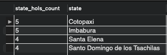

---
jupytext:
  formats: md:myst
  text_representation:
    extension: .md
    format_name: myst
    format_version: 0.13
    jupytext_version: 1.15.0
kernelspec:
  display_name: Python 3 (ipykernel)
  language: python
  name: python3
---

# Documentation and Reasoning for SQL Query

This page documents the thought and reasoning process of arriving at the final state of the query to be used in the dataset analysis for this project.

## Motivation of building this query
The final state of the query is built upon the consideration of joining all necessary tables together as a complete table. When queried into working notebook as pandas dataframe, EDA can begin without the need to perform pandas join afterwards. Having a complete or full dataframe to begin with also allows slicing and dicing much easier (i.e. EDA on a particular city or stores).

## The aim for the query final state
Merge as much columns as we can together in the early stage of the project. We will not be needing to jump between database and working space to dig for more data at later phase of analysis. 

## About the setup

Workstation: MacOS 13 (arm64)<br>
Software: MySQL Community Server - GPL (8.0.33)<br>
Environment: localhost

## About the database and dataset

The 5 main files used in our analysis are the following csv files which are locally uploaded using MySQL Workbench. Therein these csv files are located in `time_series` database. We also use the file names as name of individual tables and simple abbreviations in our query to be straightforward.

<div align="center">

| File name | Table name (In database) | Table name (In query) |
| :--- | :---: | :---: |
| holiday_events.csv | holiday_events | `hols` |
| oil.csv | oil | `o` |
| stores.csv | stores | `st` |
| train.csv | train | `tr` |
| transactions.csv | transactions | `txn` |
</div>

## More about the dataset

### Size of tables

Let's first take a quick look at the size of tables.

```sql
-- Replace table name to check size of each table
SELECT COUNT(*)
FROM holidays_events;

SELECT COUNT(*) 
FROM INFORMATION_SCHEMA.COLUMNS
WHERE TABLE_SCHEMA = 'time_series' AND table_name = 'holidays_events';
```

<div align="center">

| Table name (In database) | Rows x Columns
| :---: | :---
| holiday_events | 350 x 6
| oil | 1218 x 2
| stores | 54 x 5
| train | **3000887 x 6**
| transactions | 83488 x 3
</div>

As train table contains the most number of rows, consider it as the fact table and the other tables as dimensions tables.

### Timeline of cities
Analyzing the length of each cities' timeline can give us a rough idea of how distributed each city time series between each other.

Why prioritize analysis on cities? Because city is on a more granular level. By inspecting on city level, we ensure we do not miss out hidden patterns as compared to analysis done on state and national level.

```{admonition} Query Explanation

````

```sql
WITH CityStartEnd AS (
  SELECT
    MIN(tr.date) AS city_start_date,
    MAX(tr.date) AS city_end_date,
    st.city
  FROM train AS tr
  LEFT JOIN stores AS st
    ON tr.store_nbr = st.store_nbr
  GROUP BY st.city
)

SELECT
  ROW_NUMBER() OVER (ORDER BY city) AS row_num,
  city_start_date,
  city_end_date,
  city
FROM CityStartEnd;
```

Join `train` and `store` tables with `store_nbr` being the common column. We only join `city` instead of `state` as city is on a more granular level and one column is sufficient for now in this analysis.

<div align="center">


</div>

Results from this analysis: Each city has the same timeline range from 2013-01-01 to 2017-08-15. But this does not guarantee that all cities will have equal number of time points (observations) so let's also check that.

### Time points of cities

```{admonition} Query Explanation

````

```sql
WITH CityObCounts AS (
  SELECT
    COUNT(*) AS time_points,
    st.city,
    st.store_nbr
  FROM train AS tr
  LEFT JOIN stores AS st
    ON tr.store_nbr = st.store_nbr
  GROUP BY st.city, st.store_nbr
)

SELECT
  ROW_NUMBER() OVER (ORDER BY city, store_nbr) AS row_num,
  time_points,
  city,
  store_nbr
FROM CityObCounts;
```
<div align="center">

| Cities time points page 1 | Cities time points page 2
:-------------------------:|:-------------------------:
 | 
</div>

Looks like all cities are having the same number of time points. It is noted that Quito store number 1 has 1 less observation. During this high level analysis, it is not significant right now.

### City/State hierarchy in Ecuador
Considering Ecuador being the country as root node in the hierarchy. This sub-section explores a high level analysis on the dataset for the following hierarchy relationship. Ecuador is the country so it is the root of the hierarchy.

<div align="center">


</div>

```{admonition} Query Explanation

````

```sql
WITH CityStoreCount AS (
  SELECT
    state,
    COUNT(DISTINCT city) as city_count,
    COUNT(*) as store_count
  FROM stores
  GROUP BY state
)

SELECT
  ROW_NUMBER() OVER (ORDER by state) AS row_num,
  state,
  city_count,
  store_count
FROM CityStoreCount;
```

<div align="center">


</div>

Most cities have around 1 to 3 stores. Pichincha have the most store count due to Quito, Ecuador's capital, being one of it's city. If we also drill deeper into store count for individual cities, we see that Quito does has the most store count.

```{admonition} Query Explanation

````

<div align="center">


</div>

### Holidays
The Kaggle competition has provided [some noteworthy pointers about the holidays](https://www.kaggle.com/competitions/store-sales-time-series-forecasting/data). So it is better that we do some analysis on the holidays of each city, state and nation. 

Due to how the Ecuador government decides the celebrated dates of the holiday, it poses some challenge in building the query. We need to be careful when merging the columns. Many times during the merging, we realized duplicated dates in `holidays_events` caused the query result to explode with additional rows with null values. The duplicated dates (`date` column) from `holidays_events` as the right table (recall that `train` is the main table, hence `train` is the left table) have resulted in a many-to-one relationship with `date` column in `train`.

Also, we were given holidays for year 2012 when the `train` starts from 2013.

Let's first count the number of days from 2012 to 2017 for each city and state, and also the Ecuador herself, with consideration of the following conditions (exclude those days from the query results):
1. Days where `transferred = True` does not count as an actual celebrated day.
2. Type of day where `type = Work Day` does not count as a celebration day.
3. Include `date` which are between `2013-01-01` - `2017-08-15`. This will align with the date range from `train`.

```{note}
Without knowing the number of days of holiday for each city first will not allow us to validate the next part of SQL join is done correctly. That is why in the earlier part, we analyzed for each city and state, their number of days of holiday.

This is an important step for the first merge for the final query as we have a source of truth to validate our workings.****
```

```sql
WITH HolidayCount AS (
  SELECT
    COUNT(DISTINCT date) AS num_hols,
    locale_name,
    locale
  FROM holidays_events
  WHERE transferred = 'False' AND type != 'Work Day' AND date BETWEEN '2013-01-01' AND '2017-08-15'
  GROUP BY locale_name, locale
)

SELECT
  ROW_NUMBER() OVER (ORDER BY locale, locale_name) AS row_num,
  locale,
  locale_name,
  num_hols
FROM HolidayCount;
```

<div align="center">


</div>

Not all cities and states have holidays. As analyzed in the previous sub-section, there are 16 states and 22 cities. But now, we see that only 4 states and 19 cities have holidays.

# First merge (City & States)

We explored the merging of columns between `train` and `holidays_events` tables. We want to have information of all holidays because these information may be related to the sales of products in `train`. In order to do so, we need a common identifying column because both `train` and `holidays_events` table do not have a common column.

- First, we can make use of `store_nbr` column from `stores` table.
- We do a LEFT JOIN on both `city` and `state` columns into `train`. Because in `holidays_events` table, there is `locale_name` column which contains name of cities and states. 

As of now, we are only interested in holidays for cities (states will come later). The query below returns 3,000,887 rows which is the same as the original rows for `train`.

```sql
SELECT
  tr.*,
  st.city
FROM time_series.train AS tr
LEFT JOIN time_series.stores AS st
  ON tr.store_nbr = st.store_nbr;
```

<div align="center">


</div>

# Second merge (City Holidays)

  Now, we have `city` column in `train`. We are ready to join `date` column from `holidays_events` so that we know how daily sales of cities' store are affected by holidays.
- We start with a separate query which tells us all holiday dates for cities only. We take the same query from CTE `HolidayCount` and from `holidays_events` include a new condition to filter city rows (`locale = 'Local'`).
- The query below will return unique date, this makes a one-to-many relationship of `date` columns with `train` table.

```sql
SELECT
  date,
  locale_name,
  GROUP_CONCAT(DISTINCT type) AS type
FROM holidays_events
WHERE type != 'Work Day' AND transferred = 'False' AND locale = 'Local' AND date BETWEEN '2013-01-01' AND '2017-08-15'
GROUP BY date, locale_name;
```

<div align="center">


</div>

```{attention}
This was an important step in the beginning because there were a lot of times we found ourselves with explosion of rows with NULL values. The explosion of rows were caused by duplicated dates from `holiday_events` table.

`GROUP_CONCAT(DISTINCT type) AS types` is written because on 2016-07-24, for city Guayaquil, there seems to be a repeated holiday on the same date. If this repeated date is not removed, it will also cause explosion of rows.

<div align="center">


</div>
```

Now moving on to the actual second merge, we take the previous query and put it as a subquery, calling it `subquery_c`.
- We join on 2 sets of matching columns - date and city name columns from `train` and `subquery_c`.
- Where there is a match on the 2 sets of matching columns from both table, temporary return value from `transferred` column from `subquery_c`, and rename if as `Yes`. If there is no match, indicating there is no holiday on that day of the city, `NULL` will be returned, and rename it as `No`.

```sql
SELECT
  tr.*,
  st.city,
  st.state,
  subquery_c.types,
  IF(subquery_c.types IS NULL, 'No', 'Yes') as city_hols
  FROM train as tr
  LEFT JOIN stores as st
    ON tr.store_nbr = st.store_nbr
  LEFT JOIN (
      SELECT
        date,
        locale_name,
        GROUP_CONCAT(DISTINCT type) AS type
      FROM holidays_events
      WHERE locale = 'Local' AND type != 'Work Day' AND transferred = 'False' AND date BETWEEN '2013-01-01' AND '2017-08-15'
      GROUP BY date, locale_name
  ) subquery_c
    ON tr.date = subquery_c.date AND st.city = subquery_c.locale_name;
```

<div align="center">


</div>

- We validate if this second LEFT JOIN is done correctly by doing a comparison with an earlier analysis on holiday of city, state and country. We want to check if the count of holiday dates are the same.
- To do this, wrap the query into a subquery again, filter `city_hols = Yes` and group the rows by name of city.
- As we see from the table comparison table below (the query below returns results on the right column), the number of holidays for all cities are the same.

```sql
SELECT
  COUNT(DISTINCT date) AS city_hols_count,
  city
FROM (
  SELECT
    tr.*,
    st.city,
    st.state,
    subquery_c.type,
    IF(subquery_c.type IS NULL, 'No', 'Yes') as city_hols
  FROM train as tr
  LEFT JOIN stores as st
    ON tr.store_nbr = st.store_nbr
  LEFT JOIN (
      SELECT
        date,
        locale_name,
        GROUP_CONCAT(DISTINCT type) AS type
      FROM holidays_events
      WHERE locale = 'Local' AND type != 'Work Day' AND transferred = 'False' AND date BETWEEN '2013-01-01' AND '2017-08-15'
      GROUP BY date, locale_name
  ) subquery_c
    ON tr.date = subquery_c.date AND st.city = subquery_c.locale_name
) subquery2
WHERE city_hols = 'Yes'
GROUP BY city
```

<div align="center">

| CTE `HolidayCount` | City Holidays
:-------------------------:|:-------------------------:
 | 
</div>

# Third merge (State Holidays)

Next, we explore on joining state holidays. To do this, we are able to take the same subquery from the second merge. However, this will unnecessarily lengthen the query. What we can do is to use SQL CTE, making the query shorter and more readable.

````{warning}
<b>BUT</b> if we were to built a CTE of common holidays and continue with the next SQL LEFT JOIN for states, we would expect a result in days, where in reality is not a holiday, were mistakenly given holidays. This happens when the name of city and state are the same (E.g. Loja which is both city and state name).

The query below comes after we modify `subquery_c` into a reuseable CTE named `CommonHolidays` and went ahead with a SQL LEFT JOIN. Note that in `CommonHolidays` we do not have a filter condition for `locale = 'Local'` anymore and also different grouping because `CommonHolidays` is suppose to contain all holidays for city, states and country.

```sql
WITH CommonHolidays AS (
  SELECT
    date,
    locale_name,
    GROUP_CONCAT(DISTINCT type) AS type
  FROM holidays_events
  WHERE type != 'Work Day' AND transferred = 'False' AND date BETWEEN '2013-01-01' AND '2017-08-15'
  GROUP BY date, locale_name
)

SELECT
  COUNT(DISTINCT date) AS state_hols_count,
  state
FROM (
  SELECT
    tr.*,
    st.city,
    st.state,
    ch_city.type AS city_hols_type,
    IF(ch_city.type IS NULL, 'No', 'Yes') as city_hols,
    ch_state.type AS state_hols_type,
    IF(ch_state.type IS NULL, 'No', 'Yes') as state_hols
  FROM train AS tr
  LEFT JOIN stores AS st
    ON tr.store_nbr = st.store_nbr
  LEFT JOIN CommonHolidays AS ch_city
    ON tr.date = ch_city.date AND st.city = ch_city.locale_name
  LEFT JOIN CommonHolidays AS ch_state
    ON tr.date = ch_state.date AND st.state = ch_state.locale_name
) subquery
WHERE state_hols = 'Yes'
GROUP BY state;
```

<div align="center">


</div>

By validating with CTE `HolidayCount` we noticed 2 more states (Loja and Esmeraldas) were "given" holidays mistakenly.
````

- The workaround will be to either revert back to using subquery or create a second SQL CTE for state (a temporary result set with only states holiday).
- In order to retain query maintainability and readability, we proceeded with the latter.
- As we see from the table comparison table below (the query below returns results on the right column), the number of holidays for all states are now the same.
- Also note that CTE `StateHolidays` do not require `GROUP_CONCAT` function as holidays for state do not have duplicated dates unlike city holidays.

```sql
SELECT
  COUNT(DISTINCT date) AS state_hols_count,
  state
FROM (
  WITH CityHolidays AS (
    SELECT
      date,
      locale_name,
      GROUP_CONCAT(DISTINCT type) AS type
    FROM holidays_events
    WHERE type != 'Work Day' AND locale = 'Local' AND transferred = 'False' AND date BETWEEN '2013-01-01' AND '2017-08-15'
    GROUP BY date, locale_name
  ),
  
  StateHolidays AS (
    SELECT
      date,
      locale_name,
      type
    FROM holidays_events
    WHERE type != 'Work Day' and locale = 'Regional' and transferred = 'False' AND date BETWEEN '2013-01-01' AND '2017-08-15'
    GROUP BY date, locale_name, type
  )
  
  SELECT
    tr.*,
    st.city,
    st.state,
    c_hols.type AS city_hols_type,
    IF(c_hols.type IS NULL, 'No', 'Yes') as city_hols,
    s_hols.type AS state_hols_type,
    IF(s_hols.type IS NULL, 'No', 'Yes') as state_hols
  FROM train AS tr
  LEFT JOIN stores AS st
    ON tr.store_nbr = st.store_nbr
  LEFT JOIN CityHolidays AS c_hols
    ON tr.date = c_hols.date AND st.city = c_hols.locale_name
  LEFT JOIN StateHolidays AS s_hols
    ON tr.date = s_hols.date AND st.state = s_hols.locale_name
) subquery
WHERE state_hols = 'Yes'
GROUP BY state;
```

<div align="center">

| CTE `HolidayCount` | State Holidays
:-------------------------:|:-------------------------:
 | 
</div>

# Fourth merge (Country Holidays)

The last SQL LEFT JOIN for this section will be getting all holiday dates for Ecuador. This merge is also quite tricky because there are also duplicated dates. And the way that the duplicated dates are handled differently as we saw from Second merge (City Holidays).

- We write the query below to quickly check if there are any duplicated dates.
- Indeed there are 4 duplicated dates.

```sql
SELECT
  date,
  COUNT(*) AS count_occurrence
FROM time_series.holidays_events
WHERE type != 'Work Day' AND locale = 'National' AND transferred = 'False' AND date BETWEEN '2013-01-01' AND '2017-08-15'
GROUP BY date
HAVING COUNT(*) > 1;
```

<div align="center">


</div>

To deal with duplicated dates for country holidays, we first explored how we can filter out the duplicates in the CTE which we want to use during the fourth merge.

- For each unique row defined by date, assign a row number (`rn`).
- The row number restarts for each new date. Where duplicate dates occur, the row number increases.

```sql
SELECT
  date,
  locale_name,
  type,
  rn
FROM (
  SELECT
    date,
    locale_name,
    type,
    ROW_NUMBER() OVER(PARTITION BY date ORDER BY type) AS rn
  FROM holidays_events
  WHERE type != 'Work Day' AND locale = 'National' AND transferred = 'False' AND date BETWEEN '2013-01-01' AND '2017-08-15'
) AS RankedHolidays
WHERE date IN ('2014-12-26','2016-05-01','2016-05-07','2016-05-06');
```

<div align="center">


</div>

What we have to do now, is to exclude those duplicate dates from in the CTE during the fourth merge. At the same time, we also validate the count of country holidays with CTE `HolidayCount`

```sql
SELECT COUNT(DISTINCT date) AS country_hols_count
FROM (
  WITH CityHolidays AS (
    SELECT
      date,
      locale_name,
      GROUP_CONCAT(DISTINCT type) AS type
    FROM holidays_events
    WHERE type != 'Work Day' AND locale = 'Local' AND transferred = 'False' AND date BETWEEN '2013-01-01' AND '2017-08-15'
    GROUP BY date, locale_name
  ),
  
  StateHolidays AS (
    SELECT
      date,
      locale_name,
      type
    FROM holidays_events
    WHERE type != 'Work Day' and locale = 'Regional' and transferred = 'False' AND date BETWEEN '2013-01-01' AND '2017-08-15'
    GROUP BY date, locale_name, type
    ),
    
  NationHolidays AS (
    SELECT
      date,
      locale_name,
      type
    FROM (
      SELECT
        date,
        locale_name,
        type,
        ROW_NUMBER() OVER(PARTITION BY date ORDER BY locale_name, type) AS rn
      FROM holidays_events
      WHERE type != 'Work Day' AND locale = 'National' AND transferred = 'False' AND date BETWEEN '2013-01-01' AND '2017-08-15'
    ) AS RankedHolidays
    WHERE rn = 1
  )
  
SELECT
  tr.*,
  st.city,
  st.state,
  c_hols.type AS city_hols_type,
  IF(c_hols.type IS NULL, 'No', 'Yes') as city_hols,
  s_hols.type AS state_hols_type,
  IF(s_hols.type IS NULL, 'No', 'Yes') as state_hols,
  n_hols.type AS nation_hols_type,
  IF(n_hols.type IS NULL, 'No', 'Yes') as nation_hols
FROM train AS tr
LEFT JOIN stores AS st
  ON tr.store_nbr = st.store_nbr
LEFT JOIN CityHolidays AS c_hols
  ON tr.date = c_hols.date AND st.city = c_hols.locale_name
LEFT JOIN StateHolidays AS s_hols
  ON tr.date = s_hols.date AND st.state = s_hols.locale_name
LEFT JOIN NationHolidays AS n_hols
  ON tr.date = n_hols.date
) subquery
WHERE nation_hols = 'Yes';
```

<div align="center">

| CTE `HolidayCount` | Country Holidays
:-------------------------:|:-------------------------:
 | 
</div>

Validation success. The count of country holidays is the same as CTE `HolidayCount` after we add the 4 duplicate dates with 131.

# Fifth merge (oil prices)
With all holidays information in the main query, let's move on to merging the prices of oil into the main query. Before merging we check if there are any duplicated dates again.

The following query checks if there are any dates where the count of occurrence is more than 1 (meaning duplicated dates). If there are no duplicated dates, the results should be empty

```sql
SELECT
  date,
  COUNT(*) AS count_occurrence
FROM time_series.oil
GROUP BY date
HAVING COUNT(*) > 1;
```

<div align="center">


</div>

Awesome! The result of the query is empty, meaning there are no duplicated dates. Now, we can safely carry out the fifth merge.

```sql
WITH CityHolidays AS (
  SELECT
    date,
    locale_name,
    GROUP_CONCAT(DISTINCT type) AS type
  FROM holidays_events
  WHERE type != 'Work Day' AND locale = 'Local' AND transferred = 'False' AND date BETWEEN '2013-01-01' AND '2017-08-15'
  GROUP BY date, locale_name
),

StateHolidays AS (
  SELECT
    date,
    locale_name,
    type
  FROM holidays_events
  WHERE type != 'Work Day' and locale = 'Regional' and transferred = 'False' AND date BETWEEN '2013-01-01' AND '2017-08-15'
  GROUP BY date, locale_name, type
  ),
  
NationHolidays AS (
  SELECT
    date,
    locale_name,
    type
  FROM (
    SELECT
      date,
      locale_name,
      type,
      ROW_NUMBER() OVER(PARTITION BY date ORDER BY locale_name, type) AS rn
    FROM holidays_events
    WHERE type != 'Work Day' AND locale = 'National' AND transferred = 'False' AND date BETWEEN '2013-01-01' AND '2017-08-15'
  ) AS RankedHolidays
  WHERE rn = 1
)
  
SELECT
  tr.*,
  st.city,
  st.state,
  c_hols.type AS city_hols_type,
  IF(c_hols.type IS NULL, 'No', 'Yes') as city_hols,
  s_hols.type AS state_hols_type,
  IF(s_hols.type IS NULL, 'No', 'Yes') as state_hols,
  n_hols.type AS nation_hols_type,
  IF(n_hols.type IS NULL, 'No', 'Yes') as nation_hols,
  o.dcoilwtico AS oil_price
FROM train AS tr
LEFT JOIN stores AS st
  ON tr.store_nbr = st.store_nbr
LEFT JOIN CityHolidays AS c_hols
  ON tr.date = c_hols.date AND st.city = c_hols.locale_name
LEFT JOIN StateHolidays AS s_hols
  ON tr.date = s_hols.date AND st.state = s_hols.locale_name
LEFT JOIN NationHolidays AS n_hols
  ON tr.date = n_hols.date
LEFT JOIN oil as o
  ON tr.date = o.date
```

Note that due to non-trading days, there are no oil prices. Hence, there will be NULL rows after merging. No addition rows being generated as well which means this merge is completed with no errors.

<div align="center">


</div>

# Sixth merge (store type and cluster)
This is a straightforward merge where we include the `type` and `cluster` of each store into the main query, using `store_nbr` as the common column.

Since `store` table has been merge into `train` during the first merge, bringing in `type` and `cluster` column into main query will be easy. Simply add the these 2 columns into the main query.

```sql
WITH CityHolidays AS (
  SELECT
    date,
    locale_name,
    GROUP_CONCAT(DISTINCT type) AS type
  FROM holidays_events
  WHERE type != 'Work Day' AND locale = 'Local' AND transferred = 'False' AND date BETWEEN '2013-01-01' AND '2017-08-15'
  GROUP BY date, locale_name
),

StateHolidays AS (
  SELECT
    date,
    locale_name,
    type
  FROM holidays_events
  WHERE type != 'Work Day' and locale = 'Regional' and transferred = 'False' AND date BETWEEN '2013-01-01' AND '2017-08-15'
  GROUP BY date, locale_name, type
  ),
  
NationHolidays AS (
  SELECT
    date,
    locale_name,
    type
  FROM (
    SELECT
      date,
      locale_name,
      type,
      ROW_NUMBER() OVER(PARTITION BY date ORDER BY locale_name, type) AS rn
    FROM holidays_events
    WHERE type != 'Work Day' AND locale = 'National' AND transferred = 'False' AND date BETWEEN '2013-01-01' AND '2017-08-15'
  ) AS RankedHolidays
  WHERE rn = 1
)
  
SELECT
  tr.*,
  st.city,
  st.state,
  c_hols.type AS city_hols_type,
  IF(c_hols.type IS NULL, 'No', 'Yes') as city_hols,
  s_hols.type AS state_hols_type,
  IF(s_hols.type IS NULL, 'No', 'Yes') as state_hols,
  n_hols.type AS nation_hols_type,
  IF(n_hols.type IS NULL, 'No', 'Yes') as nation_hols,
  o.dcoilwtico AS oil_price,
  st.type,
  st.cluster
FROM train AS tr
LEFT JOIN stores AS st
  ON tr.store_nbr = st.store_nbr
LEFT JOIN CityHolidays AS c_hols
  ON tr.date = c_hols.date AND st.city = c_hols.locale_name
LEFT JOIN StateHolidays AS s_hols
  ON tr.date = s_hols.date AND st.state = s_hols.locale_name
LEFT JOIN NationHolidays AS n_hols
  ON tr.date = n_hols.date
LEFT JOIN oil as o
  ON tr.date = o.date
```

Again, no addition rows which is a good sign that the query works as intended.

<div align="center">


</div>

# Seventh merge (transactions)
The last merge of the main query will be transactions of each store and at given date. The Kaggle website did not provide any relevant information about transactions. To ensure credibility of our research, we rely on author of the most voted Kaggle notebook for this challenge for the meaning behind this column. At the time of working this project (Aug 2023), we referenced to [Ekrem Bayar](https://www.kaggle.com/ekrembayar)'s which can be found [here](https://www.kaggle.com/code/ekrembayar/store-sales-ts-forecasting-a-comprehensive-guide).

```sql
WITH CityHolidays AS (
  SELECT
    date,
    locale_name,
    GROUP_CONCAT(DISTINCT type) AS type
  FROM holidays_events
  WHERE type != 'Work Day' AND locale = 'Local' AND transferred = 'False' AND date BETWEEN '2013-01-01' AND '2017-08-15'
  GROUP BY date, locale_name
),

StateHolidays AS (
  SELECT
    date,
    locale_name,
    type
  FROM holidays_events
  WHERE type != 'Work Day' and locale = 'Regional' and transferred = 'False' AND date BETWEEN '2013-01-01' AND '2017-08-15'
  GROUP BY date, locale_name, type
  ),
  
NationHolidays AS (
  SELECT
    date,
    locale_name,
    type
  FROM (
    SELECT
      date,
      locale_name,
      type,
      ROW_NUMBER() OVER(PARTITION BY date ORDER BY locale_name, type) AS rn
    FROM holidays_events
    WHERE type != 'Work Day' AND locale = 'National' AND transferred = 'False' AND date BETWEEN '2013-01-01' AND '2017-08-15'
  ) AS RankedHolidays
  WHERE rn = 1
)
  
SELECT
  tr.*,
  st.city,
  st.state,
  c_hols.type AS city_hols_type,
  IF(c_hols.type IS NULL, 'No', 'Yes') as city_hols,
  s_hols.type AS state_hols_type,
  IF(s_hols.type IS NULL, 'No', 'Yes') as state_hols,
  n_hols.type AS nation_hols_type,
  IF(n_hols.type IS NULL, 'No', 'Yes') as nation_hols,
  o.dcoilwtico AS oil_price,
  st.type,
  st.cluster,
  txn.transactions
FROM train AS tr
LEFT JOIN stores AS st
  ON tr.store_nbr = st.store_nbr
LEFT JOIN CityHolidays AS c_hols
  ON tr.date = c_hols.date AND st.city = c_hols.locale_name
LEFT JOIN StateHolidays AS s_hols
  ON tr.date = s_hols.date AND st.state = s_hols.locale_name
LEFT JOIN NationHolidays AS n_hols
  ON tr.date = n_hols.date
LEFT JOIN oil as o
  ON tr.date = o.date
LEFT JOIN transactions AS txn
  ON tr.date = txn.date AND tr.store_nbr = txn.store_nbr
ORDER BY id;
```

Merge is successful with no additional rows. `ORDER BY id` is added at the last time to re-sort the rows being jumbled up as a result from the merge. This is because the first match between the main query and transactions table happen to be `store_nbr = 25`. In the main query, the first record for `store_nbr = 25` is found to be at `id = 561`. Hence, SQL will re-sort the rows where the first match is found.

<div align="center">


</div>

# Conclusion
In this markdown file, we detailed out the steps which we undertook in building the final query for this project. 

We thought that this documentation is necessary as it provides detailed explanation of how the query is being built and validated for mistakes along the way. We also hope being transparent in our thought process can serve as a means to welcome mistakes, identify and address to them at the early part of the project.

This documentation is being tracked in [#19](https://github.com/ai-practitioners/time-series-forecasting/issues/19). If there are any discrepancies found, please do not hesitate the comment on the issue! 