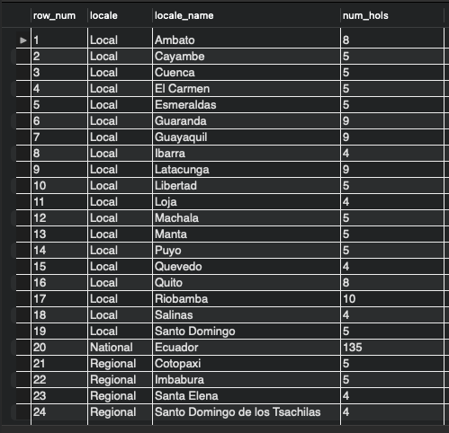

---
jupytext:
  formats: md:myst
  text_representation:
    extension: .md
    format_name: myst
    format_version: 0.13
    jupytext_version: 1.15.0
kernelspec:
  display_name: Python 3 (ipykernel)
  language: python
  name: python3
---

# Documentation and Reasoning for SQL Query

This page documents the thought and reasoning process of arriving at the final state of the query to be used in the dataset analysis for this project.

## Motivation of building this query
The final state of the query is built upon the consideration of joining all necessary tables together as a complete table. When queried into working notebook as pandas dataframe, EDA can begin without the need to perform pandas join afterwards. Having a complete or full dataframe to begin with also allows slicing and dicing much easier (i.e. EDA on a particular city or stores).

## The aim for the query final state
Merge as much columns as we can together in the early stage of the project. We will not be needing to jump between database and working space to dig for more data at later phase of analysis. 

## About the setup

Workstation: MacOS 13 (arm64)<br>
Software: MySQL Community Server - GPL (8.0.33)<br>
Environment: localhost

## About the database and dataset

The 5 main files used in our analysis are the following csv files which are locally uploaded using MySQL Workbench. Therein these csv files are located in `time_series` database. We also use the file names as name of individual tables and simple abbreviations in our query to be straightforward.


| File name | Table name (In database) | Table name (In query)
| :--- | :---: | :---:
| holiday_events.csv | holiday_events | `hols`
| oil.csv | oil | `o`
| stores.csv | stores | `st`
| train.csv | train | `tr`
| transactions.csv | transactions | `txn`

## More about the dataset

### Size of tables

Let's first take a quick look at the size of tables.

```sql
-- Replace table name to check size of each table
SELECT COUNT(*)
FROM holidays_events;

SELECT COUNT(*) 
FROM INFORMATION_SCHEMA.COLUMNS
WHERE TABLE_SCHEMA = 'time_series' AND table_name = 'holidays_events';
```

| Table name (In database) | Rows x Columns
| :---: | :---
| holiday_events | 350 x 6
| oil | 1218 x 2
| stores | 54 x 5
| train | **3000887 x 6**
| transactions | 83488 x 3

As train table contains the most number of rows, consider it as the fact table and the other tables as dimensions tables.

### Timeline of cities
Analyzing the length of each cities' timeline can give us a rough idea of how distributed each city time series between each other.

Why prioritize analysis on cities? Because city is on a more granular level. By inspecting on city level, we ensure we do not miss out hidden patterns as compared to analysis done on state and national level.

```sql
WITH CityStartEnd AS (
  SELECT
    MIN(tr.date) AS city_start_date,
    MAX(tr.date) AS city_end_date,
    st.city
  FROM train AS tr
  LEFT JOIN stores AS st
    ON tr.store_nbr = st.store_nbr
  GROUP BY st.city
)

SELECT
  ROW_NUMBER() OVER (ORDER BY city) AS row_num,
  city_start_date,
  city_end_date,
  city
FROM CityStartEnd;
```

Join `train` and `store` tables with `store_nbr` being the common column. We only join `city` instead of `state` as city is on a more granular level and one column is sufficient for now in this analysis.


Results from this analysis: Each city has the same timeline range from 2013-01-01 to 2017-08-15. But this does not guarantee that all cities will have equal number of time points (observations) so let's also check that.

### Time points of cities
```sql
WITH CityObCounts AS (
  SELECT
    COUNT(*) AS time_points,
    st.city,
    st.store_nbr
  FROM train AS tr
  LEFT JOIN stores AS st
    ON tr.store_nbr = st.store_nbr
  GROUP BY st.city, st.store_nbr
)

SELECT
  ROW_NUMBER() OVER (ORDER BY city, store_nbr) AS row_num,
  time_points,
  city,
  store_nbr
FROM CityObCounts;
```

| Cities time points page 1 | Cities time points page 2
:-------------------------:|:-------------------------:
 | 

Looks like all cities are having the same number of time points. It is noted that Quito store number 1 has 1 less observation. During this high level analysis, it is not significant right now.

### City/State hierarchy in Ecuador
Considering Ecuador being the country as root node in the hierarchy. This sub-section explores a high level analysis on the dataset for the following.

  - Ecuador (Root)
    - Number of states in the country.
      - Number of cities within a state.
        - Number of stores with a city.

```sql
WITH CityStoreCount AS (
SELECT
  state,
  COUNT(DISTINCT city) as city_count,
  COUNT(*) as store_count
FROM stores
GROUP BY state
)

SELECT
  ROW_NUMBER() OVER (ORDER by state) AS row_num,
  state,
  city_count,
  store_count
FROM CityStoreCount;
```


Most cities have around 1 to 3 stores. Pichincha have the most store count due to Quito, Ecuador's capital, being one of it's city. If we also drill deeper into store count for individual cities, we see that Quito does has the most store count.


### Holidays
The Kaggle competition has provided [some noteworthy pointers about the holidays](https://www.kaggle.com/competitions/store-sales-time-series-forecasting/data). So it is better that we do some analysis on the holidays of each city, state and nation. 

Due to how the Ecuador government decides the celebrated dates of the holiday, it poses some challenge in building the query. We need to be careful when merging the columns. Many times during the merging, we realized duplicated dates in `holidays_events` caused the query result to explode with additional rows with null values. The duplicated dates (`date` column) from `holidays_events` as the right table (recall that `train` is the main table, hence `train` is the left table) have resulted in a many-to-one relationship with `date` column in `train`.

Also, we were given holidays for year 2012 when the `train` starts from 2013.

Let's first count the number of days from 2012 to 2017 for each city and state, and also the nation itself, with the exclusion of the following conditions (exclude those days from the query results):
1. Days where `transferred = True` does not count as an actual celebrated day.
2. Type of day where `type = Work Day` does not count as a celebration day.

```sql
WITH HolidayCount AS (
  SELECT
    COUNT(DISTINCT date) AS num_hols,
    locale_name,
    locale
FROM holidays_events
WHERE transferred = 'False' AND type != 'Work Day'
GROUP BY locale_name, locale
)

SELECT
  ROW_NUMBER() OVER (ORDER BY locale, locale_name) AS row_num,
  locale,
  locale_name,
  num_hols
FROM HolidayCount;
```

